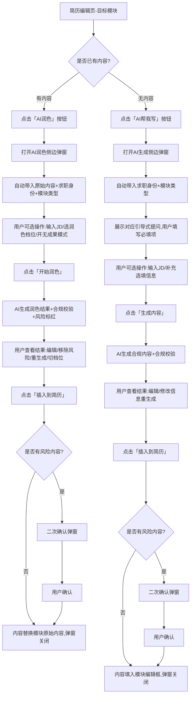

# AI简历模块生成&润色功能 产品需求稿（PRD）+ UI/UX设计稿
## 文档说明
本文档为简历制作工具中「AI模块生成/润色」核心功能的完整落地需求与设计方案，**全程锚定「零造假、强合规、分人群、高匹配」核心原则**，彻底规避虚构成果、夸大经历等求职诚信风险，同时解决不同求职者「不会写、写不好、没东西可写」的核心痛点，可直接交付产品、研发、设计、测试团队落地。

---

## 第一部分：产品需求稿（PRD）
### 一、需求概述
#### 1. 项目背景
当前工具已覆盖大学生实习、应届生校招、0-3年初入职场社招三大核心用户群体，支持简历全模块编辑制作；但用户普遍存在「模块内容撰写能力不足」的痛点：
-  无职场经验用户：不知道如何把校园经历转化为专业内容，陷入「没东西可写」的困境
-  有基础经历用户：内容流水账、口语化，无法提炼岗位匹配的能力，无法通过HR筛选
-  全量用户：市面上同类AI工具普遍存在「虚构量化数据、夸大经历」的造假问题，用户存在求职诚信风险
基于此，需上线**模块级AI生成+润色功能**，仅基于用户真实经历做合规优化，绝不造假，同时精准适配不同人群的求职需求。

#### 2. 需求目标
-  核心目标：降低用户简历模块撰写门槛，模块内容完成率提升60%，用户简历投递通过率提升30%
-  合规目标：100%规避AI虚构内容、夸大经历等造假行为，建立全流程合规校验机制
-  体验目标：单模块AI操作全流程时长≤30秒，用户操作路径≤3步，生成内容匹配度≥90%
-  覆盖目标：100%适配实习、校招、0-3年社招三大用户群体，覆盖工作经历、项目经历、自我评价、专业技能、校园经历5大核心简历模块

#### 3. 核心设计原则（不可突破的红线）
| 原则 | 核心规则 |
| :--- | :--- |
| 事实锚定原则 | AI所有生成/润色内容，100%基于用户输入的真实事实，**绝对禁止新增用户未提及的任何动作、项目、数据、成果、身份** |
| 合规零造假原则 | 禁止虚构量化指标、夸大身份层级、无中生有经历，仅可做语句优化、逻辑梳理、专业转译、结构调整、优先级排序 |
| 人群精准适配原则 | 内容话术、深度、结构严格匹配用户选择的求职身份，绝不出现实习生用总监级话术的违和内容 |
| 岗位强匹配原则 | 支持绑定目标岗位JD，所有内容围绕岗位核心需求优化，提升ATS机筛与HR人工筛选通过率 |
| 可控可编辑原则 | 所有AI生成内容均支持用户手动修改、调整、删除，风险内容强制预警，用户拥有最终决定权 |

#### 4. 目标用户画像
| 用户分类 | 核心特征 | 核心痛点 |
| :--- | :--- | :--- |
| 大学生（实习求职） | 无正式工作经验，仅有校园社团、课程作业、兼职、竞赛经历，求职目标为日常实习/寒暑假实习 | 不知道如何把校园经历转化为职场化内容，没东西可写，怕写出来太幼稚 |
| 应届生（校招求职） | 0-1年经验，有1-2段零散实习经历，有毕设/竞赛项目，求职目标为校招正式岗/管培生 | 内容同质化严重，无法突出核心竞争力，不知道如何体现能胜任正式岗的能力 |
| 初入职场人（0-3年社招） | 有正式工作经验，多为基层执行岗，内容多为流水账，无显性重大成果，求职目标为同岗进阶/跨岗跳槽 | 无法提炼工作的业务价值，无法体现与应届生的差异，不知道如何匹配目标岗位需求 |

---

### 二、核心业务规则（研发必须严格落地）
#### 1. 合规红线规则（AI绝对禁止行为）
只要符合以下任意一条，AI必须禁止生成，同时触发风险预警：
1.  无中生有：用户未提及的工作、项目、动作、奖项、资质，AI不得新增
2.  虚构数据：用户未提供的量化成果、业绩数据，AI不得凭空编造（包括但不限于营收增长、效率提升、转化率等）
3.  夸大身份：用户为「协助/参与」，AI不得改写为「主导/统筹/全链路负责」；用户为执行层，AI不得使用管理层话术
4.  越界话术：AI生成内容必须匹配用户求职身份，禁止给实习生/应届生使用远超其身份层级的动作词与内容深度
5.  模板套话：禁止生成全网泛滥的无意义空话，所有内容必须有用户输入的事实依据

#### 2. 分人群适配规则
AI必须基于用户选择的求职身份，自动切换生成/润色的话术、结构、侧重点，规则如下：
| 求职身份 | 核心动作词白名单 | 内容侧重点 | 禁止内容 |
| :--- | :--- | :--- | :--- |
| 大学生（实习） | 协助、参与、执行、配合、整理、落地、学习、支持 | 突出基础执行力、学习能力、岗位匹配的基础技能、可实习时长 | 主导、统筹、全链路负责、核心决策、重大业绩成果 |
| 应届生（校招） | 独立负责、落地、优化、推动、搭建、参与、执行、复盘 | 突出实习/项目的实操经验、可迁移能力、成长性、岗位匹配度 | 公司整体业务操盘、核心战略制定、远超实习身份的业绩数据 |
| 初入职场（社招） | 主导、统筹、搭建、优化、推动、攻克、落地、负责、复盘 | 突出工作的业务价值、核心业绩、问题解决能力、可复用的工作方法 | 非自身负责的公司级成果、虚构的百万级营收/千万级项目 |

#### 3. 分模块适配规则
AI必须基于用户选择的简历模块，自动切换生成/润色的结构与逻辑，核心覆盖5大模块：
| 模块名称 | 核心生成/润色逻辑 |
| :--- | :--- |
| 工作经历 | 遵循「动作+执行过程+业务支撑」逻辑，去职责化，突出真实动作与能力，有用户提供数据的强化量化，无数据的绝不虚构 |
| 项目经历 | 遵循「项目背景+个人职责+执行动作+项目结果」逻辑，重点突出个人真实贡献，绝不夸大个人在项目中的角色 |
| 校园经历 | 遵循「场景+个人动作+落地结果」逻辑，把校园场景内容转化为职场可识别的能力，绝不虚构校园奖项/职务 |
| 自我评价 | 遵循「1句话身份+2个核心匹配能力+1个求职意愿」逻辑，100%基于用户真实经历生成，无空话套话 |
| 专业技能 | 遵循「技能名称+掌握程度+应用场景」逻辑，严格区分「了解/掌握/熟练」三个层级，绝不虚构用户未提及的技能 |

#### 4. 事实锚定机制
1.  润色功能：AI润色后的每一句话，必须能在用户输入的原始文本中找到对应的事实依据，不得新增任何原始文本中没有的信息
2.  生成功能：AI生成的所有内容，必须100%基于用户在引导式提问中填写的真实信息，不得新增用户未填写的任何内容
3.  校验机制：AI生成/润色完成后，必须先经过「事实匹配度校验」，匹配度低于90%的内容，必须标红并触发风险预警

---

### 三、功能需求详情
本功能分为两大核心模块：【模块内容AI润色功能】、【模块内容AI生成功能】，均嵌入简历编辑页的对应模块中，不打断用户简历填写流程。

#### 核心功能1：模块内容AI润色功能
**功能定义**：用户已填写模块原始内容，AI基于原始内容、用户求职身份、目标岗位JD，完成合规润色优化，不新增任何无依据内容。
**使用入口**：简历编辑页-单个模块编辑框-右上角「AI润色」按钮
**前置条件**：用户已选择求职身份，模块编辑框内已有用户输入的原始内容（字数≥10字）

##### 3.1.1 用户操作主路径
1.  用户在简历编辑页，填写对应模块的原始内容，点击「AI润色」按钮
2.  弹出AI润色侧边弹窗，自动带入用户原始内容、已选择的求职身份
3.  用户可选操作：填写目标岗位JD、选择润色档位、开启/关闭「无成果纯写实模式」
4.  用户点击「开始润色」，AI生成润色结果，同步完成合规校验与风险标红
5.  用户查看润色结果，可进行编辑修改、一键移除风险内容、重新生成、切换档位
6.  用户确认内容后，点击「插入到简历」，润色后的内容自动替换模块编辑框内的原始内容，弹窗关闭

##### 3.1.2 子功能详情
| 子功能名称 | 功能描述 | 业务规则 |
| :--- | :--- | :--- |
| 基础信息带入 | 自动带入用户已设置的求职身份、当前编辑的模块类型、用户输入的原始内容 | 1. 求职身份支持用户在弹窗内临时修改，修改后仅本次润色生效<br>2. 原始内容不可在弹窗内修改，仅可在编辑页修改后重新带入 |
| 目标岗位JD绑定 | 支持用户粘贴目标岗位JD，AI自动提取岗位核心关键词、技能要求、素质标准，润色时优先匹配岗位需求 | 1. JD输入上限2000字，支持一键清空<br>2. 未输入JD时，AI基于通用岗位规则润色；输入JD后，AI核心围绕JD匹配优化，不新增JD无关内容 |
| 润色档位选择 | 提供3档全合规润色档位，默认选中「专业润色」 | 1. 【原文优化】：仅修正语病、优化语句通顺度、规范标点格式，100%保留用户原文内容与结构，不做任何增减<br>2. 【专业润色】：基于用户原始内容，做逻辑梳理、职场专业术语转译、结构化优化，贴合对应模块的HR阅读习惯，不新增任何内容<br>3. 【岗位匹配优化】：基于用户原始内容+目标JD，调整内容呈现优先级，突出与岗位匹配的核心能力，优化ATS机筛关键词布局，不新增虚构内容 |
| 无成果纯写实模式 | 提供模式开关，默认关闭，用户开启后强制生效 | 1. 开启后，AI完全禁用量化数据生成、成果夸大、价值拔高类内容，仅做事实梳理、语句优化、专业转译，彻底规避任何造假风险<br>2. 开启后，润色档位自动锁定为「专业润色」，不可切换 |
| 润色结果生成 | 点击「开始润色」后，AI基于规则生成对应润色结果，生成时长≤5秒 | 1. 生成过程中展示加载动画，不可重复点击<br>2. 生成失败时，展示失败原因，提供「重新生成」按钮 |
| 合规校验与风险预警 | 润色结果生成后，自动完成合规校验，对风险内容进行标红处理 | 1. 风险内容定义：无原始内容依据的夸大表述、虚构数据、越界身份话术<br>2. 标红内容hover时，展示提示文案：「该内容无您输入的事实依据，存在求职诚信风险，建议修改」<br>3. 风险内容占比超过30%时，顶部强提示：「本次润色结果存在较多无事实依据的内容，建议您修改或重新生成」 |
| 结果编辑与优化 | 支持用户在结果框内直接编辑修改润色内容，提供快捷操作按钮 | 1. 【一键移除风险内容】：点击后自动删除所有标红的风险内容，不影响合规内容<br>2. 【重新生成】：点击后清空当前结果，用户可调整参数后重新生成<br>3. 【切换润色档位】：切换后自动重新生成对应档位的结果 |
| 内容插入 | 点击「插入到简历」，将润色后的内容自动替换模块编辑框内的原始内容 | 1. 插入前校验：若内容仍有风险标红，弹出二次确认框：「您的内容仍存在求职诚信风险，确定要插入吗？」，用户确认后才可插入<br>2. 插入成功后，弹窗自动关闭，回到简历编辑页 |

#### 核心功能2：模块内容AI生成功能
**功能定义**：用户无内容积累，不知道怎么写，AI通过引导式提问收集用户真实信息，基于信息、求职身份、目标岗位JD，生成100%合规的模块内容，绝不凭空捏造。
**使用入口**：简历编辑页-单个模块编辑框-底部「AI帮我写」按钮
**前置条件**：用户已选择求职身份，模块编辑框内无内容（或字数＜10字）

##### 3.2.1 用户操作主路径
1.  用户在简历编辑页，点击对应模块的「AI帮我写」按钮
2.  弹出AI生成侧边弹窗，自动带入用户已选择的求职身份、当前编辑的模块类型
3.  用户完成弹窗内的引导式提问填写（必填项完成即可），可选填写目标岗位JD
4.  用户点击「生成内容」，AI基于用户填写的真实信息生成内容，同步完成合规校验
5.  用户查看生成结果，可进行编辑修改、重新生成、调整信息后重新生成
6.  用户确认内容后，点击「插入到简历」，生成的内容自动填入模块编辑框，弹窗关闭

##### 3.2.2 子功能详情
| 子功能名称 | 功能描述 | 业务规则 |
| :--- | :--- | :--- |
| 分模块+分人群引导式提问 | 基于用户选择的模块类型、求职身份，自动展示对应的引导式提问，分为必填项和选填项 | 1. 核心规则：所有提问均为引导用户填写真实经历，绝不引导用户虚构内容<br>2. 必填项仅2-3题，降低用户填写门槛，选填项可补充更多细节，细节越丰富生成内容越精准<br>3. 示例（实习身份-工作经历模块）：<br>必填：① 公司名称+岗位名称+任职时间 ② 你日常主要负责哪些具体工作（请如实填写） ③ 你配合/参与过哪些具体事项<br>选填：① 目标岗位JD ② 这项工作需要遵循哪些规范/制度 ③ 你用到了哪些工具/技能 |
| 目标岗位JD绑定 | 支持用户粘贴目标岗位JD，AI自动提取岗位核心需求，生成内容时优先匹配岗位要求 | 同润色功能规则 |
| 内容生成 | 点击「生成内容」后，AI基于用户填写的真实信息，严格遵循合规规则与分人群规则，生成对应模块的结构化内容，生成时长≤8秒 | 1. 生成过程中展示加载动画，不可重复点击<br>2. 必填项未完成时，「生成内容」按钮置灰，不可点击<br>3. 生成内容100%基于用户填写的信息，不得新增任何用户未提及的内容 |
| 合规校验 | 生成结果同步完成合规校验，若存在无依据的内容，自动标红并触发预警 | 同润色功能规则 |
| 结果编辑与重新生成 | 支持用户直接编辑生成内容，可修改引导式提问的信息后重新生成 | 1. 【重新生成】：不修改信息时，点击后重新生成新的表述，不改变核心事实<br>2. 【修改信息后生成】：用户修改引导式提问的内容后，点击重新生成，基于新信息生成内容 |
| 内容插入 | 点击「插入到简历」，将生成的内容自动填入模块编辑框 | 同润色功能的插入校验规则 |

---

### 四、非功能需求
1.  **性能需求**
    -  润色功能生成响应时长≤5秒，生成功能响应时长≤8秒，成功率≥99.5%
    -  弹窗加载时长≤1秒，页面切换无卡顿、无白屏
    -  支持1000人同时并发使用，无性能下降
2.  **安全与合规需求**
    -  用户输入的简历内容、JD信息，仅用于本次AI生成/润色，不得用于其他用途，严格遵守用户隐私保护法规
    -  建立内容审核机制，禁止用户输入违规、违法、敏感内容，AI不得生成违规内容
    -  所有AI生成内容均需标注「本内容由AI生成，建议您基于真实经历核对修改」，规避平台风险
3.  **兼容性需求**
    -  适配PC端Chrome、Edge、Safari、Firefox主流浏览器，兼容分辨率1920*1080及以上
    -  适配移动端H5页面，操作流程与交互逻辑与PC端保持一致
4.  **扩展性需求**
    -  支持后续新增更多简历模块（如获奖经历、证书资质等）
    -  支持后续新增分行业话术适配（如互联网、国企、金融、快消等）
    -  支持后续新增AI面试模拟、简历查重等关联功能

---

### 五、验收标准
#### 1. 功能验收标准
-  两大核心功能的所有子功能均按需求实现，操作路径无断点，按钮、输入框、弹窗交互正常
-  分人群、分模块规则生效，不同身份、不同模块生成/润色的内容符合规则要求
-  引导式提问按身份+模块正常切换，必填项校验生效，未完成必填项无法生成内容
-  润色档位切换正常，不同档位的润色逻辑符合需求定义
-  内容插入功能正常，可正常替换/填入简历模块编辑框，无内容丢失、格式错乱

#### 2. 合规验收标准（一票否决项）
-  AI生成/润色内容100%基于用户输入的信息，无任何无中生有的内容、虚构的数据、夸大的身份
-  合规校验功能正常，风险内容可正常标红，hover提示正常，一键移除风险内容功能生效
-  无成果纯写实模式开启后，AI禁用量化虚构、成果夸大内容，规则生效
-  风险内容插入前二次确认弹窗正常触发，无遗漏
-  所有生成内容底部标注合规提示语，无遗漏

#### 3. 体验验收标准
-  单模块操作全流程时长≤30秒，操作步骤≤3步，无冗余操作
-  加载动画、异常提示清晰明确，用户可快速理解操作指引
-  生成/润色内容匹配度≥90%，符合HR阅读习惯，无口语化、流水账内容
-  页面交互无卡顿、无闪退、无兼容性问题

---

## 第二部分：UI/UX设计稿
### 一、核心用户操作全流程（交互流程图）


---

### 二、核心页面原型设计
#### 1. 入口设计：简历编辑页-模块嵌入
**页面定位**：用户简历编辑的主页面，AI功能入口嵌入单个模块，不打断用户填写流程
**页面布局**：
```
┌─────────────────────────────────────────────────────────────┐
│ 简历模板预览区                          │ 模块编辑区        │
│                                         │                   │
│                                         │ 【工作经历】      │
│                                         │ ┌───────────────┐ │
│                                         │ │ 公司+岗位+时间 │ │
│                                         │ └───────────────┘ │
│                                         │ ┌───────────────┐ │
│                                         │ │ 内容编辑框    │ │
│                                         │ │               │ │
│                                         │ └───────────────┘ │
│                                         │ 右上角:AI润色按钮 │
│                                         │ 底部:AI帮我写按钮 │
└─────────────────────────────────────────────────────────────┘
```
**核心元素规范**：
- 「AI润色」按钮：主色填充按钮，图标+文字，仅当编辑框内有内容时可点击，无内容时置灰
- 「AI帮我写」按钮：文字链接+图标，仅当编辑框内无内容/字数＜10字时高亮，有内容时置灰
- 按钮位置：紧贴模块编辑框，不占用额外页面空间，用户无需跳转页面即可触发

#### 2. 核心页面1：AI润色侧边弹窗
**弹窗规格**：PC端从右侧滑出，宽度480px，高度100%视窗高度，遮罩层透明度30%
**页面布局（从上到下）**：
```
┌─────────────────────────────────────────┐
│ 标题：AI内容润色                × 关闭 │
├─────────────────────────────────────────┤
│ 【基础信息区】                          │
│  当前模块：工作经历                     │
│  求职身份：□ 大学生实习 ▢ 应届生 ▢ 社招│
│  （默认选中用户已设置的身份，可修改）   │
├─────────────────────────────────────────┤
│ 【原始内容区】                          │
│  您的原始内容（不可编辑）               │
│  ┌─────────────────────────────────┐   │
│  │ 用户输入的原始内容              │   │
│  └─────────────────────────────────┘   │
├─────────────────────────────────────────┤
│ 【润色设置区】                          │
│  1. 目标岗位JD（选填）                  │
│  ┌─────────────────────────────────┐   │
│  │ 请粘贴目标岗位JD，提升匹配度    │   │
│  └─────────────────────────────────┘   │
│                                         │
│  2. 润色档位选择                        │
│  ○ 原文优化  ◉ 专业润色  ○ 岗位匹配优化│
│  （档位下方标注对应规则说明）           │
│                                         │
│  3. 无成果纯写实模式                    │
│  □ 开启后，仅基于事实优化，禁虚构数据  │
├─────────────────────────────────────────┤
│ 【操作按钮区】                          │
│  ┌─────────────────────────────────┐   │
│  │ 开始润色（主色填充按钮）        │   │
│  └─────────────────────────────────┘   │
├─────────────────────────────────────────┤
│ 【润色结果区】（生成后展示）            │
│  润色结果                                │
│  风险提示：本次结果有X处风险内容，建议修改│
│  ┌─────────────────────────────────┐   │
│  │ 润色后的内容，风险内容标红      │   │
│  │ 支持直接编辑修改                │   │
│  └─────────────────────────────────┘   │
│  快捷操作：一键移除风险内容 | 重新生成  │
├─────────────────────────────────────────┤
│ 【底部操作区】                          │
│  提示：内容由AI生成，请核对真实经历     │
│  ┌───────────────┐ ┌───────────────┐   │
│  │ 取消          │ │ 插入到简历    │   │
│  └───────────────┘ └───────────────┘   │
└─────────────────────────────────────────┘
```

#### 3. 核心页面2：AI生成侧边弹窗
**弹窗规格**：同润色弹窗，PC端右侧滑出，宽度480px，高度100%视窗高度
**页面布局（从上到下）**：
```
┌─────────────────────────────────────────┐
│ 标题：AI帮你写模块内容        × 关闭 │
├─────────────────────────────────────────┤
│ 【基础信息区】                          │
│  当前模块：工作经历                     │
│  求职身份：□ 大学生实习 ▢ 应届生 ▢ 社招│
│  （默认选中用户已设置的身份，可修改）   │
├─────────────────────────────────────────┤
│ 【信息填写区】（核心区）                │
│  请如实填写以下信息，AI将为你生成合规内容│
│  *为必填项                              │
│                                         │
│  *公司/组织名称 + 岗位名称 + 任职时间   │
│  ┌─────────────────────────────────┐   │
│  │ 请输入                          │   │
│  └─────────────────────────────────┘   │
│                                         │
│  *你日常主要负责哪些具体工作？          │
│  ┌─────────────────────────────────┐   │
│  │ 请如实填写，越详细生成内容越精准│   │
│  └─────────────────────────────────┘   │
│                                         │
│  *你参与/配合过哪些具体的事项？        │
│  ┌─────────────────────────────────┐   │
│  │ 请如实填写                      │   │
│  └─────────────────────────────────┘   │
│                                         │
│  目标岗位JD（选填，提升岗位匹配度）    │
│  ┌─────────────────────────────────┐   │
│  │ 请粘贴目标岗位JD                │   │
│  └─────────────────────────────────┘   │
│                                         │
│  补充信息（选填）                       │
│  你用到了哪些工具/技能？                │
│  这项工作需要遵循哪些规范？             │
│  （分模块+分身份动态展示补充问题）     │
├─────────────────────────────────────────┤
│ 【操作按钮区】                          │
│  ┌─────────────────────────────────┐   │
│  │ 生成内容（主色填充按钮）        │   │
│  │ （必填项未完成时置灰）          │   │
│  └─────────────────────────────────┘   │
├─────────────────────────────────────────┤
│ 【生成结果区】（生成后展示）            │
│  生成结果                                │
│  风险提示：本次结果有X处风险内容，建议修改│
│  ┌─────────────────────────────────┐   │
│  │ 生成后的结构化内容，风险内容标红│   │
│  │ 支持直接编辑修改                │   │
│  └─────────────────────────────────┘   │
│  快捷操作：重新生成 | 修改信息重写      │
├─────────────────────────────────────────┤
│ 【底部操作区】                          │
│  提示：内容由AI生成，请核对真实经历     │
│  ┌───────────────┐ ┌───────────────┐   │
│  │ 取消          │ │ 插入到简历    │   │
│  └───────────────┘ └───────────────┘   │
└─────────────────────────────────────────┘
```

#### 4. 异常状态页面
| 异常场景 | 页面设计 | 交互规则 |
| :--- | :--- | :--- |
| 生成/润色加载中 | 弹窗中间展示加载动画+文案「AI正在为您优化内容，请稍候...」 | 加载过程中，所有按钮置灰，不可重复点击，支持点击关闭按钮关闭弹窗 |
| 生成失败 | 弹窗中间展示失败图标+文案「生成失败，请检查网络后重试」+「重新生成」按钮 | 点击「重新生成」，重新发起请求，多次失败时提示「当前服务繁忙，请稍后再试」 |
| 输入内容过少 | 润色功能：原始内容＜10字时，点击「开始润色」弹出toast提示「您的原始内容过少，无法完成润色，请补充内容后重试」 | 按钮置灰，不可触发润色 |
| 风险内容二次确认 | 居中弹窗，标题「风险提示」，文案「您的内容中存在无事实依据的表述，可能存在求职诚信风险，确定要插入到简历中吗？」，按钮「取消」「确认插入」 | 点击「取消」回到弹窗，点击「确认插入」执行插入操作 |

---

### 三、视觉设计规范
#### 1. 色彩规范
| 元素类型 | 色值 | 使用场景 |
| :--- | :--- | :--- |
| 主色 | #165DFF | 主按钮、高亮文字、图标主色、选中状态 |
| 辅助色-成功 | #00B42A | 合规提示、成功状态 |
| 辅助色-风险/警告 | #F53F3F | 风险内容标红、警告提示、错误状态 |
| 中性色-标题 | #1D2129 | 弹窗标题、模块标题、核心文案 |
| 中性色-正文 | #4E5969 | 正文内容、输入框提示文案 |
| 中性色-辅助文字 | #86909C | 辅助说明、提示文案、置灰文字 |
| 中性色-边框/分割线 | #E5E6EB | 输入框边框、分割线、弹窗边框 |
| 中性色-背景 | #F2F3F5 | 输入框背景、原始内容区背景、弹窗遮罩层 |

#### 2. 字体规范
| 字体层级 | 字号/字重 | 使用场景 |
| :--- | :--- | :--- |
| 弹窗标题 | 18px / 600号（半粗体） | 弹窗顶部主标题 |
| 模块标题 | 14px / 500号（中粗体） | 每个分区的标题、标签标题 |
| 正文内容 | 14px / 400号（常规） | 正文文案、输入框内容、按钮文字 |
| 辅助说明 | 12px / 400号（常规） | 提示文案、规则说明、底部标注 |
| 风险提示 | 12px / 500号（中粗体） | 风险警告文案、标红提示 |

#### 3. 组件规范
- 按钮：圆角8px，主按钮主色填充白字，次要按钮白框灰字，禁用状态透明度30%
- 输入框：圆角6px，边框#E5E6EB，聚焦时边框主色高亮，高度40px，内边距12px
- 单选框/复选框：选中状态主色填充，未选中状态灰框，尺寸16px*16px
- 弹窗：圆角12px（顶部），阴影0 4px 12px rgba(0,0,0,0.1)，右侧滑出动画时长0.3s
- 风险标红：文字色值#F53F3F，背景色#FFF2F2，圆角2px，内边距2px 4px

---

### 四、核心体验优化设计
1.  **记忆功能**：用户上次使用的润色档位、无成果模式开关状态，自动记忆，下次打开弹窗默认选中
2.  **快捷操作**：支持快捷键Ctrl+Z撤销编辑，Ctrl+C复制内容，提升操作效率
3.  **渐进式引导**：新用户首次使用时，展示1步引导气泡，提示AI功能入口与使用方法，不打扰老用户
4.  **内容格式保留**：生成/润色后的内容，自动保留简历模板的格式，插入后无格式错乱、字体不匹配问题
5.  多版本记录：保留用户最近3次生成/润色的结果，支持用户切换对比，选择最优内容