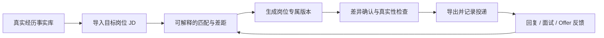

# 智简简历竞品分析与长期增长规划

更新日期：2026-07-10  
适用阶段：已有真实用户与收入、从“功能建设”转向“增长与商业化验证”  
核心目标：用户增长、营收增长、建立可持续差异化

## 0. 结论先行

智简简历现在不是一个“缺功能的 MVP”。产品已经拥有 28 个可见模板、PC 与移动端编辑、AI 生成/导入/润色、PDF/PNG/Markdown 导出、微信登录与支付、会员/邀请、SEO/AEO 内容矩阵和基础数据后台。

下一步不应该继续堆模板，也不应该马上做招聘平台、社区或原生 App。当前最值得投入的主线只有两条：

1. **先把现有流量变成更多激活与收入**：修复 AI/导入首用断点、统一商业承诺、修正数据口径、提升生成结果采用率和首次导出率。
2. **把产品从“做一份简历”升级为“一岗一简历”**：用真实经历事实库、JD、岗位版本、投递结果和面试准备形成求职闭环。

建议的新定位是：

> **跨招聘平台的一岗一简历与求职反馈系统。**

建议的用户承诺是：

> **把你的真实经历，变成针对每个岗位、能直接投递，也经得起面试追问的版本。**

未来的核心闭环应当是：

## 1. 研究口径与限制

### 外部资料

- 竞品和价格均为 2026-07-10 的公开页面快照，后续可能因渠道、活动和 A/B 测试变化。
- 竞品披露的用户数、模板数、成功率等属于厂商自述，不视为经审计数据。
- 优先使用官网、官方帮助页、App Store、官方接口和研究机构资料。

### 内部数据

- 数据库聚合查询时间：2026-07-10 11:48（Asia/Shanghai）。
- 行为分析窗口：最近 30 天，结束时间为 2026-07-11 00:00。
- 部分账号可能来自小程序历史迁移，因此“新增账号”不能直接等同于纯新增获客。
- 行为埋点存在缺事件、来源字段混用和 Session 持久化问题；不同漏斗中的独立用户口径并不完全一致。
- 收入接口顶层 `paidOrders` 和 `totalAmount` 错误返回 0，但套餐明细与渠道明细有真实订单。本文用套餐明细求和，最近 30 天为 610 单、¥10,501。

## 2. 当前经营基线

### 2.1 用户与内容资产

| 指标 | 当前值 | 说明 |
| --- | ---: | --- |
| 累计账号 | 69,752 | 可能含小程序迁移账号 |
| 有至少 1 份简历的用户 | 30,018 | 占累计账号约 43.0% |
| 累计简历 | 40,978 | 其中约 18.9% 的简历用户有 2 份及以上 |
| 累计导出记录 | 22,138 | PC 本地 PNG/Markdown 等未必全部入库 |
| 最近 30 天新增账号 | 28,219 | 需拆分真实新客与迁移 |
| 最近 30 天新增简历 | 17,731 | 数据库创建记录 |
| 最近 30 天导出记录 | 12,546 | 数据库导出记录 |
| 可见模板 | 28 | 注册 29 个，隐藏 1 个 |
| Sitemap URL | 约 319 | 含 126 篇文章、10 篇范文、140 个岗位页等 |

最近 30 天新账号中：

- 44.7% 创建过简历；
- 31.6% 有导出记录；
- 9.0% 创建过多份简历；
- 3.5% 有多次导出记录。

这说明产品已经具有真实需求和一定重复使用，但“从账号到首份可投递文件”仍有很大提升空间。

### 2.2 30 天漏斗

严格时序漏斗为：

| 步骤 | 用户数 | 相对上一步 |
| --- | ---: | ---: |
| 访问 | 21,836 | - |
| 登录 | 6,175 | 28.3% |
| 新建简历成功 | 2,885 | 46.7% |
| 首次导出成功 | 2,267 | 78.6% |
| 二次导出/再次操作 | 864 | 38.1% |
| 看到导出付费墙 | 455 | 52.7% |
| 创建订单 | 94 | 20.7% |
| 支付成功 | 88 | 93.6% |

独立事件口径还显示：

- 30,112 位用户触发过页面访问；
- 10,434 位用户开始创建，6,746 位创建成功，近似成功率 64.7%；
- 13,474 位用户预览过简历，7,177 位导出成功；
- 2,102 位用户看过支付页，527 位触发支付成功，近似支付页转化 25.1%；
- AI 整份生成 2,880 次开始、2,239 次成功，但只有 554 次“采用结果”事件。若埋点完整，采用率仅约 24.7%，是非常大的价值流失点。

关键判断：**订单创建后的支付链路已经很强，问题主要发生在更前面——首用、创建、AI 结果采用、付费价值理解。**

### 2.3 收入基线

最近 30 天套餐明细：

| 商品 | 订单 | 收入 | 收入占比 |
| --- | ---: | ---: | ---: |
| 单次导出 | 181 | ¥1,791.9 | 17.1% |
| 月会员 | 283 | ¥4,174.7 | 39.8% |
| 年会员 | 34 | ¥1,081.6 | 10.3% |
| 永久会员 | 112 | ¥3,452.8 | 32.9% |
| 合计 | 610 | **¥10,501.0** | 100% |

最近 7 天为 145 单、¥2,695.5，折算月度运行速度约 ¥11,550。当前客单价约 ¥17.2—18.6。

渠道收入：

- 小程序/虚拟支付：¥6,490.2，占 61.8%；
- Web/微信支付：¥4,010.8，占 38.2%。

当前每位页面访问用户带来的月收入约为：

> ¥10,501 ÷ 30,112 ≈ **¥0.35 / 访问用户**

因此现在不适合做大规模付费买量。以当前收入效率，能承受的获客成本非常低。应先把收入/访问用户提升到至少 ¥0.8—1.0，再考虑搜索或信息流投放。

### 2.4 用户声音与运营执行

- 数据库共有 57 条反馈，46 条仍是 `RECEIVED`；最近 30 天 13 条。
- 关键词粗分中，18 条涉及导出/付费，10 条涉及可靠性，7 条涉及模板/排版，6 条涉及 AI/导入。
- 站外发布日志只有 7 条已发布记录，集中在 6 月 22—23 日；所有阅读、点赞、收藏、评论、分享指标仍为空。

这表明当前问题不是“缺营销计划和素材”，而是**缺稳定执行、渠道归因和复盘机制**。

## 3. 当前最紧急的产品问题

### P0-1：未登录用户的 AI/导入主路径可能被直接禁用

`use-vip-store.ts` 把未登录用户的 AI 额度初始化为 0；`/ai` 和 `/import` 又把 `remaining === 0` 解释成“今日次数已用完”，禁用主按钮并引导升级会员。后端同时拒绝无用户 ID 的请求。

结果是：首页最重要的“免费生成简历”流量，可能在用户还没有体验价值之前就被错误当成额度耗尽。

应改为以下任一正确流程：

1. 用户填完信息并点击生成时要求登录，登录后恢复现场并继续；或
2. 允许访客生成预览，在保存/导出时登录；或
3. 未登录状态显示“登录后获得今日 3 次免费生成”，绝不能显示“已用完”。

这是第一周必须验证并修复的增长 P0。

### P0-2：免费、导出、水印、模板和会员权益互相冲突

当前不同页面同时出现：

- 免费额度内无水印 PDF；
- 免费用户“当前导出有水印”；
- PNG/Markdown 对所有人开放；
- 非会员不能导出 PNG/Markdown；
- 移动端 Markdown 永久免费；
- 精品模板会员解锁；
- 实际模板又没有会员字段，所有用户可见。

这会同时伤害信任、客服效率、价格实验和付费转化。必须建立唯一的 `Entitlement / Offer Catalog`，官网、FAQ、会员页、支付墙、PC、移动端和服务端都读取同一套配置。

### P0-3：营销承诺超过实际交付

当前页面宣称“一键派生多个 JD 版本、自动重写”，实际只有普通复制和整份优化，没有岗位实体、版本关系、差异对比或投递管理。

此外还有：

- 宣称可自由切换 DeepSeek、通义千问，实际后端只有 Qwen Plus/Max；
- 宣称一对一简历指导，但仓库中没有预约与交付链路；
- 首页“真实用户反馈”来自静态数组；
- 会员页硬编码“超过 10,000 名求职者已选择会员版简历”，缺少可验证数据来源。

短期要么删除/降级这些文案，要么补齐交付。增长不能建立在用户进入产品后发现“功能只是宣传语”的基础上。

### P0-4：隐私与账号安全必须在放大流量前解决

- 官网写“简历不会被分享给第三方”，隐私政策却说明会发送给 AI 提供商；文本导入链路未发现发送前脱敏。
- 登录凭据由客户端直接写入长期 Cookie，简历 API 又直接信任该 Cookie；当前仓库未发现签名 Session 或服务端逐次校验。

建议立即做安全审计、服务端 Session、敏感字段脱敏/明确同意和可验证的删除机制。隐私可信可以成为智简相对招聘平台的真正优势，但前提是产品行为和承诺一致。

### P0-5：增长数据无法可靠回答“用户从哪里来”

- `source` 同时承担外部来源和内部流程入口，例如 `source=ai` / `source=import`；
- `sessionId` 存在 `localStorage`，不是浏览器 Session；
- 文章、岗位页、范文页 CTA 没有 slug 归因；
- JD、模块 AI、邀请、部分导出和支付成功事件缺失；
- 收入后台顶层聚合和收入占比字段返回错误。

在修正前，继续跨 5 个平台发内容只会制造“看起来很忙、但不知道什么有效”的状态。

## 4. 竞品格局

### 4.1 市场已经分成五类

| 类别 | 代表产品 | 它们靠什么赢 | 对智简的威胁 |
| --- | --- | --- | --- |
| 模板与编辑器 | 五百丁、锤子简历、木及简历、Canva/WPS | 模板规模、编辑成熟、低价或免费 | 基础制作已商品化，模板难形成定价权 |
| AI 简历平台 | 超级简历、UP 简历、知页、52CV | AI 生成、诊断、范文、跨端、品牌 | 正面争夺同一用户和搜索流量 |
| 招聘平台内置工具 | BOSS 直聘、牛客、脉脉、智联、猎聘 | 职位、投递、回复和招聘结果数据 | 最大长期威胁，离结果最近 |
| 新一代求职 OS | Teal、Rezi、TruboCV、OfferKit、Joblytic | JD、多版本、投递看板、面试 | 定义下一阶段用户预期 |
| 通用 AI 替代品 | 豆包、DeepSeek、ChatGPT、Kimi | 文案生成免费、用户规模大 | “AI 会写简历”不再是差异化 |

### 4.2 关键竞品对比

| 产品 | 公开价格快照 | 核心优势 | 智简应该学什么 / 避开什么 |
| --- | --- | --- | --- |
| [超级简历](https://www.wondercv.com/) | 月 ¥18、终身 ¥98、AI 导师单次 ¥9.9 | 强品牌、对话 AI、跨端、岗位/学校 SEO、人工服务 | 学对话式事实挖掘；不跟模板数量和低价终身卷 |
| [知页简历](https://www.zhiyeapp.com/) | 7 天 ¥12、月 ¥18、永久约 ¥28—39.9 | 牛客校招生态、案例库、移动编辑 | 学生态承接；避免产品与价格口径长期漂移 |
| [五百丁](https://www.500d.me/) | 价格需登录查看 | 长尾模板、范文、行业/院校 SEO | 学搜索意图覆盖；不做纯静态内容农场 |
| [锤子简历](https://www.100chui.com/vip/) | 月 ¥15.9、终身 ¥49.9 | 低价、导入/翻译/多格式完整 | 证明基础功能价格已被压低；不要正面价格战 |
| [木及简历](https://www.mujicv.com/pricing/) | 月 ¥9.9、年 ¥29.9 | 内容与样式分离、稳定一页、免费导出 | 学底层文档模型与可靠性 |
| [职徒简历 52CV](https://www.52cv.com/purchase) | 月 ¥18、年 ¥88、终身 ¥96 | 简历、面试、课程、导师、高校 B2B | 学求职冲刺包与机构渠道；避免业务过度庞杂 |
| [BOSS 直聘简历](https://cv.zhipin.com/) | 30 天 ¥68、60 天 ¥98 | 300+ 模板、AI、导入、与职位和 BOSS 一键同步 | 最高威胁；智简必须做跨平台中立与版本反馈 |
| [Teal](https://www.tealhq.com/pricing) | $13/周、$29/30 天、$79/90 天 | 无限简历、JD 匹配、投递 CRM、浏览器插件、面试 | 最值得参考的产品结构和短期冲刺定价 |
| [Rezi](https://www.rezi.ai/rezi-docs/rezi-subscription-plans-explained) | $29/月、$149 终身 | ATS/JD、AI Agent、真人审核、B2B 白标 | 学岗位结果和机构版；AI 不应无限绑定低价终身 |
| [Kickresume](https://www.kickresume.com/en/pricing/sale/) | 约 $24/月；学生可获免费期 | AI、ATS、职业地图、学生和好友增长 | 学学生认证和好友裂变，不照搬高海外客单价 |

### 4.3 最重要的竞争结论

1. **AI 生成、润色、翻译和 ATS 分数已经是入场券。** 搜索结果中大量 2026 新产品都同时提供 JD 匹配、简历优化、模拟面试和投递看板。
2. **独立简历工具的基础订阅价格被压在约 ¥10—18/月。** 继续卖模板和导出，很难显著提高 LTV。
3. **越接近招聘结果，价格越高。** BOSS 不是因为模板更漂亮而能卖 ¥68/30 天，而是因为它有职位、投递、查看、回复和竞争力数据。
4. **国际领先产品都在从 Builder 转向 Career OS。** Teal、Rezi、Resume.io、Kickresume 已把 JD、版本、岗位、面试和投递串起来。
5. **“真实性”是尚未被充分占领的差异化。** Hays 的调查一边显示中国求职者高度使用 AI，一边明确指出泛化、误导和真实性担忧。

## 5. 市场机会与目标用户

Hays 2025 调研显示，中国大陆 69% 的受访求职者会使用 AI 求职，67% 用于简历润色或翻译，45% 会针对特定岗位做 AI 优化。北京大学 2026 年论文基于 2025 年高校毕业生调查，发现使用 GenAI 辅助求职者落实就业的概率是未使用者的 1.11 倍，主要机制是增加投递数和单位接收数。

需求已经被验证，但“让 AI 生成一段文字”会迅速免费化。真正可付费的是：

- 更理解目标岗位；
- 更可信、不虚构；
- 更快生成多个岗位版本；
- 让简历、投递和面试保持一致；
- 帮用户知道哪一版有效。

### 核心 ICP

优先服务：

> **0—5 年经验、正在密集求职、会同时投递 10 个以上岗位的中国求职者。**

重点包括应届生、转行者和 1—5 年职场新人。他们通常已经有零散经历、旧简历或 AI 生成文本，真正的痛点不是“完全没有内容”，而是：

- 不知道不同 JD 应该突出什么；
- 每改一个岗位都要复制粘贴；
- AI 容易写得漂亮但失真；
- 不知道哪个版本带来了回复；
- 面试时讲不清 AI 改写后的经历。

### 暂时不优先

- 高管猎聘和高端职业咨询；
- 蓝领招聘市场；
- 海外多语言 CV 全面扩张；
- 自建职位市场或职场社区；
- 原生 iOS/Android App。

## 6. 产品战略：从 Resume Builder 到 Job Workspace

### 6.1 四层产品结构

#### 第一层：候选人事实库

从旧简历、AI 问答和编辑器中沉淀：

- 教育、工作、项目、技能；
- 每条成果的动作、结果、数字和证据来源；
- 可以公开的事实与敏感信息；
- 用户明确确认的“不可改写边界”。

AI 的所有改写都应标明：原文、修改后、修改原因、依据哪条真实经历。不能凭空创造数字、客户、技能和项目。

#### 第二层：岗位工作区

每个岗位保存：

- 公司、岗位、JD、来源链接/截图；
- 硬要求、软要求、关键词、风险项；
- 关联的简历版本；
- 当前状态：收藏、准备、已投、已读、沟通、面试、Offer、拒绝。

#### 第三层：岗位材料包

基于同一事实库和 JD 生成：

- 岗位专属简历；
- HR/BOSS 打招呼话术；
- 求职信/邮件；
- 30 秒与 2 分钟自我介绍；
- 该 JD 的面试题和回答要点。

#### 第四层：结果反馈

低成本收集：

- 是否投递；
- 是否被查看/回复；
- 是否进入面试；
- 哪一版简历、哪个渠道、哪个岗位；
- 失败原因和下一版修改。

只有这一层形成后，智简才会拥有模板站和通用大模型没有的数据资产。

### 6.2 北极星指标

短期北极星：

> **每周完成并导出至少 1 份岗位专属版本的用户数（WJRE）。**

等投递功能上线后升级为：

> **每周完成一次有效岗位投递的用户数。**

不建议用 DAU 作为北极星。简历产品天然是阶段性、任务型产品；真正要提高的是一个求职周期内的岗位版本数、投递数、结果反馈率和收入，而不是让用户无目的地每天打开。

### 6.3 指标树

| 层级 | 核心指标 |
| --- | --- |
| 获客 | 合格访问用户、首次/末次来源、岗位页→产品点击率、CAC |
| 激活 | 24 小时内创建成功、AI 结果采用、首次编辑、首次导出 |
| 价值 | JD 保存率、岗位版本创建率、每位活跃求职者版本数 |
| 留存 | 7/30 天再次创建岗位版本、二次导出、投递回访率 |
| 收入 | 支付页→支付、收入/访问用户、收入/激活用户、客单价、AI 毛利 |
| 结果 | 投递、回复、面试、Offer 的自报转化 |
| 护栏 | 每千 Session 错误、导出成功率、AI 采用率、虚构举报、退款/投诉 |

## 7. 商业模式与定价

### 7.1 原则

1. 免费用户必须能完成一份真实、可投递的简历，并清楚知道免费边界。
2. 付费买的是“针对更多岗位、更快、更深、更可靠”，而不是在最后一步突然卡文件。
3. 不做模糊低价试用自动续费；采用明确固定期限，更符合当前品牌信任方向。
4. AI 成本不能无限绑定低价终身会员。所有现有永久会员必须保留原权益，新用户再切新规则。
5. 定价实验的主指标是“每位支付页访客收入”，不是单纯支付率。

### 7.2 建议的商品结构

短期先 A/B 测试，不要一次性全部切换：

| 商品 | 建议价格 | 适合人群 | 权益方向 |
| --- | ---: | --- | --- |
| 免费版 | ¥0 | 第一次做简历 | 1 份完整简历、1 次无水印 PDF、基础模板、有限 AI、基础 JD 检查 |
| 急用单次 | ¥9.9 | 只需再导出一次 | 单次导出；24 小时内升级冲刺包可抵扣 |
| 30 天求职冲刺 | ¥29.9 | 校招、跳槽、转行 | 多岗位版本、全部导出、AI 深度优化、材料包 |
| 90 天求职季 | ¥59.9 | 秋招/春招/长期求职 | 更高岗位额度、面试准备、投递复盘 |
| 岗位定制次数包 | ¥9.9/1 个，¥29.9/5 个 | 偶发使用、不想订阅 | JD 深度分析、版本生成、差异确认 |
| 人工复核 | ¥99—299 | 高意愿用户 | 先与职业教练合作分成，不自建重运营团队 |

永久会员如果保留，建议改为“永久排版版”：模板、编辑、基础导出永久可用；高成本 AI 使用次数包。现有永久会员必须 grandfather，不可追溯削减。

### 7.3 第一轮价格实验

流量已经足以做干净的两组实验：最近 30 天有约 2,102 位支付页用户，14 天可覆盖接近 1,000 人。

- A 组：维持当前单次/月/年/永久结构；
- B 组：单次 ¥9.9 + 30 天冲刺 ¥29.9 + 90 天 ¥59.9，默认不突出永久；
- 主指标：收入/支付页用户；
- 次指标：支付率、客单价、退款/投诉、7/30 天使用、AI 推理成本；
- 至少运行 14 天，并覆盖工作日与周末。

## 8. 增长战略

### 8.1 渠道优先级

#### 1. 小程序与微信裂变

小程序已经贡献约 61.8% 收入，应优先放大，而不是另做 App。

- 把“邀请好友”从额度耗尽后的隐藏选项，移到首次成功导出后的高满意时刻；
- 奖励从“导出次数”扩展为“岗位定制额度”；
- 做独立邀请中心和邀请事件埋点；
- 导出成功页生成可分享的岗位简历完成卡，但默认不展示隐私内容。

#### 2. SEO/AEO：从“有页面”转向“页面带上下文进入产品”

现有约 319 条 URL 已经足够开始验证，不应继续盲目扩量。

- 岗位页 CTA 进入 AI 时预填目标岗位；
- 范文页可以一键带入结构或示例；
- JD 工具提供免费粗评，登录后保存，付费后深度改写并派生版本；
- 每个内容页记录 `content_type`、`slug`、`role`、首次来源；
- 优先做“岗位 × 年限 × 场景”，而不是再写泛泛的“简历怎么写”。

#### 3. 小红书 + 知乎/微信，只选两条持续跑

已有跨平台素材与脚本，但发布集中在两天且无数据。未来 8 周只选：

- 小红书：面向应届生、转行者，用前后对比和真实案例；
- 知乎或公众号/社群：承接搜索、信任和长文解释。

每周以一个匿名化真实案例生产 3—4 个内容资产，所有链接使用 UTM/渠道码。停止同时经营抖音、V2EX、掘金、知乎、小红书、公众号但没有任何复盘。

#### 4. 校园与职业教练分销

核心闭环稳定后再启动：

- 学生认证赠送 14—30 天冲刺权益；
- 校园大使按激活用户或付费分成，不按发帖数；
- 职业教练可使用协作审核和白标报告；
- 先做 3—5 个合作试点，不先开发复杂机构后台。

### 8.2 三个增长循环

1. **内容循环**：岗位内容 → 免费 JD 检查 → 版本生成 → 导出 → 更多可匿名化案例。
2. **裂变循环**：成功导出 → 分享/邀请 → 好友激活 → 双方得到岗位定制额度。
3. **结果数据循环**：投递结果 → 更好的岗位建议 → 原创行业报告 → SEO/AEO 与媒体引用。

## 9. 30 天、90 天、1 年与 3 年路线图

### 第 1—7 天：停止加功能，先修漏斗和信任

1. 修复未登录 `/ai` 与 `/import` 被当成额度耗尽的问题。
2. 建立唯一权益配置，统一免费、PDF、水印、PNG、Markdown、模板和 AI 额度。
3. 下线或改写尚未实现/无法验证的承诺：一键多版本、模型自由切换、一对一指导、10,000 会员、静态“真实评价”。
4. 完成账号 Session 与简历 API 安全审计；明确第三方 AI、脱敏和用户同意。
5. 修复收入后台顶层聚合、收入占比和支付成功事件。
6. 把 `source` 拆为首次来源、末次来源、内部入口；Session 改用真正的 Session 生命周期。
7. 给 AI、导入、JD、内容 CTA、邀请、模板和所有导出补完整事件。

### 第 8—30 天：只做转化实验

1. 处理现有 46 条未完成反馈，联系 20—30 位用户：
   - 8 位已付费；
   - 8 位成功导出未付费；
   - 8 位创建/AI 中途退出；
   - 按单次、月、永久分层询问付费动机。
2. 优化 AI 结果页：明确“采用全部/逐条采用/继续编辑”，展示修改原因，目标把采用率从约 25% 提到 45% 以上。
3. 优化首次创建：保存用户已填信息，登录后无损返回；目标创建开始→成功从约 64.7% 提到 75%。
4. 上线公开、可索引、无歧义的定价页。
5. 做第一轮价格实验，主指标使用收入/支付页用户。
6. 岗位页和范文页 CTA 带岗位上下文，运行首轮内容→产品转化实验。
7. 在成功导出后增加邀请入口，奖励岗位定制额度。

### 第 31—90 天：上线“一岗一简历”MVP

用现有“复制简历 + 整份优化 + JD 粗评”能力拼成一个闭环：

1. 新增 `Job`：公司、岗位、JD、来源、状态。
2. 新增 `ResumeVersion` 或在 Resume 上增加父版本、岗位关系和快照。
3. 把旧简历解析成用户确认的事实库。
4. 从某份基础简历一键创建岗位版本，不修改母版。
5. 展示原文、建议、原因和事实来源；用户逐条确认。
6. 导出后记录“哪份版本用于哪个岗位”。
7. 生成配套的 HR 话术、自我介绍和面试问题。
8. 用 30/90 天求职冲刺包验证付费。

MVP 暂时不做自动网申、职位爬虫、复杂日历、语音面试和招聘市场。

### 第 3—6 个月：形成求职周期产品

- JD 链接/截图导入和结构化岗位画像；
- 简单投递看板、提醒和结果回访；
- 浏览器插件或“分享到智简”的轻入口；
- JD + 简历驱动的面试准备包；
- 学生认证、邀请奖励、创作者/校园分销；
- 匿名化岗位差距报告；
- 3—5 个高校就业中心或职业教练试点。

### 第 6—12 个月：建立渠道和结果数据

- 用授权的匿名结果数据比较“哪个改动与回复/面试相关”；
- 按岗位、年限和求职场景发布季度报告；
- 把高转化内容页扩展成可复用的岗位求职包；
- 推出机构席位、教练协作、白标报告；
- 在核心闭环稳定后开放轻量 API/MCP，让 AI 助手调用模板、JD 分析和版本生成。

### 第 12—36 个月：形成数据与 B2B2C 壁垒

- 岗位技能与职业路径地图；
- 基于真实投递结果的个性化建议；
- 高校、培训机构、职业教练、留学机构的 B2B2C；
- API、白标与 Agent 分发；
- 从简历收入扩展到面试、人工复核、职业咨询与机构服务。

明确不做：与 BOSS 正面竞争的职位市场，以及为了留存而堆出来的泛职场社区。

## 10. 目标与经营模型

以下是经营目标，不是无条件预测。只有前一阶段假设被数据验证，才进入下一阶段。

| 指标 | 当前基线 | 90 天目标 | 6 个月目标 | 12 个月目标 |
| --- | ---: | ---: | ---: | ---: |
| 月合格访问用户 | 约 30,000 | 45,000 | 75,000 | 150,000 |
| 新用户导出率 | 31.6% | 38% | 42% | 45% |
| 创建开始→成功 | 约 64.7% | 75% | 80% | 82% |
| AI 成功→采用 | 约 24.7%* | 45% | 60% | 65% |
| 支付页→支付成功 | 约 25.1% | 30% | 35% | 35%—40% |
| 收入/访问用户 | 约 ¥0.35 | ¥0.60—0.80 | ¥0.80—1.10 | ¥1.00—1.30 |
| 月收入 | 约 ¥10,500 | ¥25,000—35,000 | ¥50,000—80,000 | ¥120,000—200,000 |
| 每周岗位专属导出用户 | 尚未建模 | 500 | 2,000 | 6,000 |

\* AI 采用率高度依赖现有事件是否完整，应先修埋点再正式设基线。

收入目标可以用一个可解释的公式管理：

> 月收入 = 合格访问用户 × 支付入口触达率 × 支付完成率 × 每位付费用户订单数 × 客单价 + B2B 收入

当前近似为：

> 30,112 × 7.0% × 25.1% × 1.16 × ¥17.2 ≈ ¥10,500

90 天的一个可实现目标组合是：

> 45,000 × 9% × 30% × 1.10 × ¥25 ≈ ¥33,400

这比只喊“收入翻三倍”更容易拆解和执行。

## 11. 未来 90 天实验清单

| 优先级 | 实验 | 主要指标 | 判断标准 |
| --- | --- | --- | --- |
| P0 | 修复访客 AI/导入额度状态 | 首页 CTA→AI 开始、创建成功 | 无登录用户不再看到“已用完”；转化显著上升 |
| P0 | 登录后恢复现场 | 创建开始→成功 | 提升至 75%，且登录后退出率下降 |
| P0 | 权益和文案统一 | 支付页转化、投诉/反馈 | 付费率不降，权益类反馈下降 |
| P1 | AI 结果逐条采用与原因展示 | AI 成功→采用 | 14 天提升到 45%+ |
| P1 | 岗位页预填目标岗位 | 内容页→AI 开始→导出 | 相比通用 CTA 提升至少 20% |
| P1 | 30/90 天冲刺定价 | 收入/支付页用户 | 相比控制组提升 20%+，投诉不增加 |
| P1 | 导出后邀请奖励 | 邀请发送、好友激活 | 每 100 次导出带来 5 个以上新激活 |
| P1 | 免费粗评→付费深度 JD | JD 提交→登录→岗位版本 | 验证用户是否愿意为“一岗一简历”付费 |

## 12. 明确不做什么

未来 90 天建议冻结：

- 新模板军备竞赛；
- 原生 App；
- 自建招聘市场；
- 泛职场社区；
- 大规模课程业务；
- 没有归因的多平台铺量；
- 广泛付费投放；
- 无限制低价终身 AI；
- 未经验证的用户数、通过率和面试提升宣传。

## 13. 创始人每周经营节奏

### 每周一：看一张核心表

- 各来源合格访问；
- 创建、AI 采用、首次导出；
- JD/岗位版本；
- 支付入口、订单、收入/访问用户；
- 错误、退款、投诉。

### 每周二至周四：只跑 1—2 个实验

每个实验必须有假设、目标用户、主指标、护栏指标和结束日期。不要同时改首页、价格、付费墙和产品流程，导致无法归因。

### 每周五：用户与渠道复盘

- 至少 3 个用户访谈；
- 处理反馈；
- 复盘本周内容带来的访问、激活和收入；
- 决定继续、调整或停止。

### 每月：战略复盘

只回答四个问题：

1. 哪类用户最容易完成第一份简历？
2. 哪类用户最愿意付费，为什么？
3. 哪个渠道带来的不是访问，而是导出和收入？
4. “一岗一简历”是否提高了版本数、付费和求职结果？

## 14. 最终建议

智简简历目前最稀缺的不是代码能力，而是战略聚焦和经营闭环。已有用户、产品、支付和搜索基础足以支撑下一阶段，不需要再通过更多模板证明“产品很完整”。

接下来最正确的顺序是：

> **先修首用漏斗与信任 → 再把 JD、复制和 AI 优化组合成岗位版本 → 用求职冲刺包收费 → 用投递结果建立数据壁垒。**

如果这个顺序执行到位，智简简历有机会避开与模板站的低价竞争，也不必与 BOSS 的职位市场正面交锋，而是占据一个更清晰的位置：

> **任何招聘平台之外，用户都需要一个中立、可信、可复用的求职材料工作区。**

## 15. 主要外部来源

- [Hays：中国大陆求职者 AI 使用调查，2025-11-26](https://www.haysplc.com/media/press-releases/2025/60-chinese-people-ai)
- [北京大学教育评论：GenAI 辅助求职的就业促进效应，2026](https://ccj.pku.edu.cn/article/info?aid=392187699)
- [艾瑞：2024 年中国网络招聘行业研究报告](https://pdf.dfcfw.com/pdf/H3_AP202503261647793566_1.pdf)
- [BOSS 直聘简历](https://cv.zhipin.com/)
- [超级简历](https://www.wondercv.com/)
- [知页简历](https://www.zhiyeapp.com/)
- [五百丁](https://www.500d.me/)
- [锤子简历会员价格](https://www.100chui.com/vip/)
- [木及简历价格](https://www.mujicv.com/pricing/)
- [职徒简历购买页](https://www.52cv.com/purchase)
- [Teal 价格](https://www.tealhq.com/pricing)
- [Rezi 套餐说明](https://www.rezi.ai/rezi-docs/rezi-subscription-plans-explained)
- [Kickresume 价格](https://www.kickresume.com/en/pricing/sale/)
- [Resume.io 价格](https://resume.io/pricing)
- [Zety 价格](https://zety.com/pricing)
