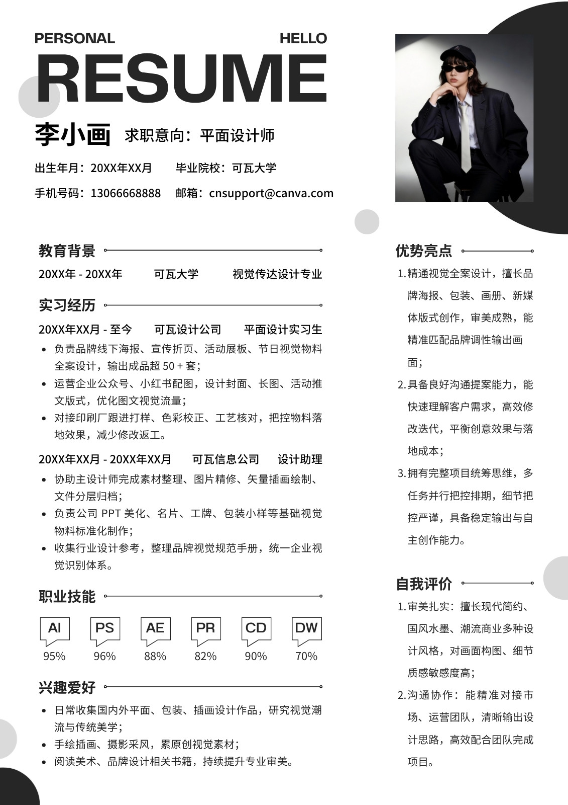
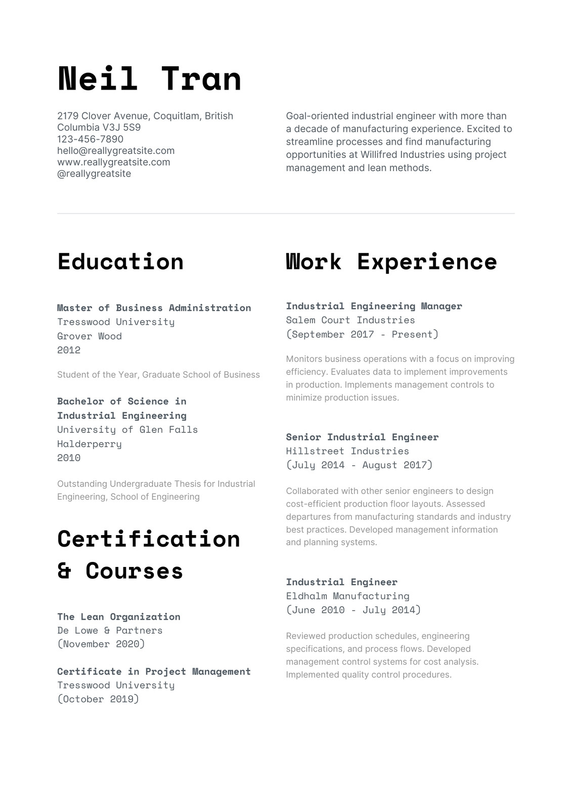
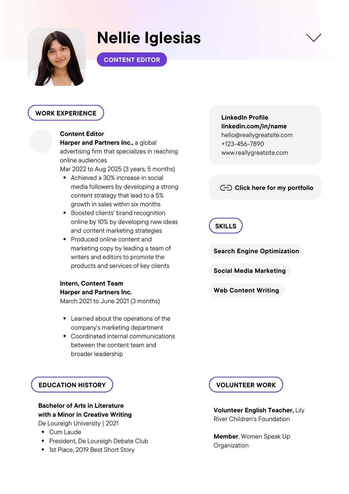

# Canva 简历模板选款与逐款实施计划

日期：2026-09-27。分支：`codex/template-taxonomy`。

状态：**根据用户“中国年轻求职者”的定位重新筛选；原 3 款降为候选资料，不再是确定的实施队列。尚未进入实现。**

最新的 10 款具体 Canva 参考短名单见 [年轻求职者 10 款选型](template-canva-youth-shortlist-10.md)。其中 4 款先验证、4 款专项候选、2 款末位备选；该名单取代本文件原 3 款的实施排序，不表示 10 款都已获准上线。

后续重筛结果见 [中国年轻求职者：第二轮中文参考筛选](template-canva-youth-selection-2026-09-27.md)：另查看 7 款真实中文原稿，保留 1 款校招细线风格候选，6 款本批不选。具体 ID、现有款对照和适配风险均已记录；仍待用户确认，不是已批准新增队列。下文第 6 节保留上一轮检查范围，不能当成后续重筛未开展。

本批是一个有边界的选款任务，不是把 Canva 全库或历史 50 款概念全部做完。现有 32 个注册项（包含重复在制款蓝序）均纳入元数据和缩略图对照。用户明确了中国年轻求职者这一首要目标后，不再以“与现有款看起来不同”为充分入选理由。

## 0. 首要约束：中国年轻求职者

用户确认的是目标人群；以下优先级和验收样例为落实该定位的产品建议，不是市场统计，也不规定用户年龄上限或限制其他用户使用。

核心场景：找实习、应届校招、毕业后职场前几年的求职/换岗。优先解决“经历不多但能清晰展示能力”和“已有少量经历、能快速突出项目与成果”，而非长篇管理资历。

| 优先级 | 场景 | 必须装得下的中文内容 | 现有款先对照 |
| --- | --- | --- | --- |
| P0 | 实习/应届通用 | 教育、课程/毕业项目、实习、校园实践、技能证书；没有工作经历仍自然 | 简约、青穗、青柠、一页通 |
| P0 | 初入职场/年轻社招 | 1–2 段工作经历、2–3 个项目及真实成果；模块顺序由用户决定 | 一页通、浅策、墨序 |
| P1 | 技术工程入门/早期职业 | 课程项目、实习项目或工作项目；技术栈、本人贡献、结果的清晰层级 | 码上、极简黑、一页通、砺锋 |
| P1 | 产品运营/市场内容 | 实习/项目的目标、动作、结果；可选作品链接，不强制凑数据 | 浅策、紫记、墨序 |
| P1 | 正式岗位的年轻求职者 | 清楚的教育、实习、证书与经历；克制装饰 | 衡简、蓝法、金行 |
| P2 | 设计/创意及英文专项 | 按实际作品或投递语言选择，不代表全部年轻人的风格 | 紫记、朱墨、墨序 |

这些是场景研究顺序，不是六款新增配额。现有模板满足时复用；确有结构或明确视觉选择价值才新增。现有六维分类保持不变，不增加“年轻人”年龄筛选，不把岗位、风格和阶段混成新的互斥分类。

选款硬门槛：

1. **先用中文看效果**：学校、专业、公司、项目、日期及中文段落可读；不能只凭英文原稿的大留白和短单词判断美观。英文参考可保留，但必须先通过同一套中文样例比较。
2. **年轻但专业**：清爽、有适度辨识度；不把年轻等同于卡通、花哨、超大英文标题或巨大照片。正文信息优先于装饰。
3. **少经历也成立**：教育 + 一个课程/校园项目即可自然成稿；空模块收拢，不用虚构实习、排名、管理业绩或技能百分比撑版。
4. **一页优先，不强行一页**：先检验典型早期职业样例的一页 A4；内容变长自然续页，不以微小字号或过窄双栏换取一页。单栏作为重要基线，双栏须证明中文长内容与阅读顺序更合适。
5. **信息可选**：头像、年龄、性别、籍贯等不作为视觉成立的前提；有头像/无头像均完整。求职意向和联系方式清楚可见。
6. **小屏和导出都可用**：模板缩略图能辨认结构，移动预览易检查，PDF 不截字、不空尾页；不承诺未经实测的 ATS 兼容。
7. **最后才检查新增价值**：与全部现有模板去重；不为差异化而牺牲目标人群适用性，也不因已有相同分类就拒绝有实质价值的参考。

比较时使用同一组明确标注为模拟的中文内容：无实习的在校生、一段实习的应届生、两段经历的年轻社招；再按岗位加入技术/运营/正式/创意样例。不得把测试内容注入真实用户简历。

## 1. 原候选的重新评估

以下名称仅为工作代号，序号只用于索引，不再代表实现顺序。保留来源与参考图便于追溯。

| 顺序 | 工作代号 | Canva 真实参考 | 拟定分类 | 新增价值 | 状态 |
| --- | --- | --- | --- | --- | --- |
| 1 | 视界 | 黑白色高级简约风设计师求职简历 / `EAHSzp0_bEE` | 设计内容专项候选 | 超大编辑式标题、左主内容右辅助栏、右上头像与几何留白 | 降为 P2 备选；验证标题/头像占比，不代表通用校招 |
| 2 | 工序 | Black and White Simple Engineer Resume / `EAEuwiyFHq8` | 技术方向历史候选 | 无深色侧栏、接近等宽双栏；左资历证书与右工作项目并读 | 暂不入选；英文资深工程履历与当前核心样例有距离 |
| 3 | 轻策 | Purple Grey Clean UI Copy Editor CV / `EAFXVdyJLDQ` | 产品运营/设计内容专项候选 | 左经历与右联系/技能卡片，胶囊标题与独立作品链接层级 | 保留备选；须先验证中文和少经历内容，不优先建设英文版 |

中文、英文是分别可用的语言版本目标，**不等于中英双语对照**；未完成语言 QA 前不注册 `en` 或 `bilingual` 标签。分类只是推荐，不能限制用户填写其他职业内容。三款虽同属双栏，但分别是编辑式右辅助栏、均衡双栏、模块卡片双栏，不靠颜色区分。

与早期规划的调整：不能因为已有单栏，就把全部新增候选都选成双栏；先验证中国年轻求职者的中文样例，再判断是否需要新增。工序的双栏建议未获确认，不是原技术单栏目标的直接实现。下列来源分析为历史候选记录，其中“保留/改编”只表示候选入选后的拟议边界，不是当前实施指令。

## 2. 来源与参考图

获取方式：在用户现有 Chrome 会话中查看 Canva 可画模板库，打开真实模板预览，读取页面“编辑模板”的模板 ID/链接，保存页面已加载的预览图。未创建 Canva 设计，未购买素材、发布、上传用户简历或更改分享权限。

连接器本轮提示需重新认证；实际选款通过可正常访问的 Canva 可画网页完成。没有用账号设计搜索代替模板库，也没有把自行绘制草图当成 Canva 原稿。

下面链接来自预览页的编辑入口，去掉了分析追踪参数；**点击可能进入 Canva 使用/编辑流程**，不是本站已实现的模板。图片为选型参考，不是可发布缩略图。

### 01 / 视界

- 原名：黑白色高级简约风设计师求职简历。
- 模板 ID：`EAHSzp0_bEE`。页面作者：`ZHIZHI工作室`。
- [Canva 使用入口](https://www.canva.cn/design?create&type=TADae_-2twE&template=EAHSzp0_bEE&category=tACZCustSTA)
- 浏览器下载原文件：`C:/Users/62765/Downloads/1131w-mWEPJKFKTaI.jpg`。
- 本地留档：`template-references/canva-batch-2026-09-27/EAHSzp0_bEE-p1.jpg`。

**对照**：紫记是紫色通栏页头和左侧辅助信息/右主栏；朱墨是红黑衬线单栏；商蓝、蓝序是大头像与蓝紫左侧栏。本稿是黑白大标题、右辅助栏，视觉重心和正文比例不同，不是上述款式换色。仍属视觉选择增加，不宣称已有项目/作品功能存在空缺。

**保留**：大标题层级、黑白基调、右上头像、左宽右窄正文和少量几何装饰。

**明确改编**：示例技能百分比/软件标识不作为默认用户事实，不自动绘制“掌握 95%”；用已有可编辑技能内容表达。头像隐藏后装饰与标题重新流动。保留作品链接的文字表达和共享附录，不引入项目图片新字段。

**风险**：中文长姓名挤占大标题、右栏长文本导致失衡、装饰遮挡编辑工具。验收必须包含无头像、长姓名、长技能、自定义模块拖动、两页内容。

### 02 / 工序

- 原名：Black and White Simple Engineer Resume。
- 模板 ID：`EAEuwiyFHq8`。页面作者：`Canva Creative Studio | 可画创意工作室`。
- [Canva 使用入口](https://www.canva.cn/design?create&type=TADae_-2twE&template=EAEuwiyFHq8&category=tACZCustSTA)
- 浏览器下载原文件：`C:/Users/62765/Downloads/1131w-dAjZ6cZWhyc.jpg`。
- 本地留档：`template-references/canva-batch-2026-09-27/EAEuwiyFHq8-p1.jpg`。
- 页面带皇冠标识；账号使用权限及后续用途授权需核实。
- 两页已查看：**第一页简历，第二页求职信**。只选第一页，不把它登记为双页简历，不新增求职信功能。

**对照**：砺锋是深色窄左栏；双栏是浅黄窄信息栏；蓝幕是渐变页头加窄信息栏；码上是代码风单栏；极简黑和一页通是单栏紧凑款。本稿以两个接近等宽的内容列并列展示资历与经历，页头把联系信息与摘要并置，信息组织不同。

**保留**：黑白排版、粗标题、均衡双栏、细横线、联系信息/摘要并列。

**明确改编**：中文正文使用项目字体；参考稿的英文打字机气质只用于适合的标题，不照搬为难读的中文等宽正文。默认可无头像，但用户仍能上传/显示头像。证书通过现有自定义模块表达，项目通过现有项目块表达；不新增证书数据库字段。

**风险**：长项目导致列高不均；双栏 PDF 的阅读顺序需验证；不宣称 ATS 认证。模块投影到左右栏不得丢失全局排序与拖动能力；若现有机制不能完整保留，先提出方案，不能偷偷禁用交互。

### 03 / 轻策

- 原名：Purple Grey Clean UI Copy Editor CV。
- 模板 ID：`EAFXVdyJLDQ`。页面作者：`Canva Creative Studio | 可画创意工作室`。
- [Canva 使用入口](https://www.canva.cn/design?create&type=TADae_-2twE&template=EAFXVdyJLDQ&category=tACZCustSTA)
- 浏览器下载原文件：`C:/Users/62765/Downloads/1131w-CDSuFVR0RkQ.jpg`。
- 本地留档：`template-references/canva-batch-2026-09-27/EAFXVdyJLDQ-p1.jpg`。
- 页面带皇冠标识；账号使用权限及后续用途授权需核实。
- 两页已查看：**第二页是第一页的提示注释版**，不是续页。注释证据保存在 `EAFXVdyJLDQ-p2-notes.jpg`，不进入成品。

**对照**：墨序是黑色联系卡加单栏时间轴；紫记是左窄栏加右侧时间轴；浅策是浅色单栏。本稿联系信息、作品入口和技能以独立浅灰卡片放右侧，经历在左侧，底部教育/补充经历并列。不是“把紫记调成浅紫色”。

**保留**：轻量渐变页头、头像姓名组合、胶囊章节标题、浅灰联系/技能卡片、左主右辅关系。

**明确改编**：作品链接只显示用户已有链接/富文本，不伪造地址或生成空按钮；没有链接时完整移除并收拢间距。没有技能结构化条目时保持富文本，不能强行把内容拆成失去可编辑性的图片标签。中文和英文独立做排版验收，不把英文小标题称为双语。

**风险**：链接可点击与导出文本、长单词换行、右栏卡片拆页、胶囊标题的工具栏点击区域。

## 3. 全量现有模板对照基线

本轮读取统一元数据并查看以下全部 32 张本地缩略图；这是本分支状态，不是线上发布状态证明。32 注册项含 31 个既有项和 1 个重复在制项。蓝芯隐藏，青云/码上/朱墨/杏坛目录隐藏，不因本次规划改变可见性。

| 分组 | 全部 ID 与名称 | 本批处理 |
| --- | --- | --- |
| 通用/紧凑单栏 | `simple` 简约、`yiyetong` 一页通、`dense` 密排、`jijian` 极简黑 | 覆盖充分，不再新增普通黑白单栏 |
| 正式/经典单栏 | `elegant` 典雅、`yuanshan` 远山、`lanfa` 蓝法、`jinhang` 金行 | 管理先复用远山；不能把示例业绩数字当用户真实内容 |
| 表格及信息表 | `tablegrid` 表格、`hengjian` 衡简 | 暂无新增同结构计划 |
| 日期/侧标 | `timeline` 时间轴、`lanjiao` 蓝角 | 侧标/日期栏类候选必须与这两款比较 |
| 清爽单栏 | `lanxin` 蓝芯、`xinghe` 星河、`qingsui` 青穗、`lanzhe` 蓝折、`lanying` 蓝营、`qiance` 浅策、`lanzix` 蓝紫、`qingyun` 青云、`qingning` 青柠 | 蓝色/渐变/校招类已经密集，不继续换色扩充 |
| 既有双栏 | `warm` 双栏、`lifeng` 砺锋、`lanmu` 蓝幕、`ziji` 紫记、`shanglan` 商蓝 | 是本批 3 款的重点对照，不因标签不同忽略同构版式 |
| 专项视觉 | `heijiao` 黑教、`xingtan` 杏坛、`mashang` 码上、`zhumo` 朱墨、`moxu` 墨序 | 教师不等于科研；英文参考优先与墨序对照 |
| 重复在制 | `jingrui` 蓝序 | 与商蓝六维分类完全相同，且视觉结构近似；退出本批新增队列，保留代码待单独处理，不删除、不宣称已下线 |

蓝序的错误不是“同标签就不能新增”，而是此前没有比较商蓝就声称补缺。以后先比较结构、内容层级和视觉，再看分类覆盖。

## 4. 本轮淘汰及暂缓

| 来源/任务 | 处理 | 理由 |
| --- | --- | --- |
| `EAHVvX8HwRY` 白黑色大气个人求职简历 | 不选 | 预览实际为校园/实习双栏，不是管理长履历；同类已有较多 |
| `EAFAR1qVefw` Black and Gold Academic Resume | 不作为科研款 | 预览内容为音乐教师履历，没有论文/科研结构；侧标组织也须对照蓝角/时间轴 |
| `EAEuwm5ZWIc` Blue and Black Academic Resume | 不作为科研款 | 预览内容为学校教师；浅色侧栏不构成科研 CV 支持 |
| `EAFARiNxgWg` Classic Resume/Curriculum Vitae | 不选 | 普通平面设计师单栏、横幅和技能评分，未体现独立结构缺口 |
| 资深管理 | 本批不新增，先验收远山 | 长履历与真实业绩编辑是能力问题，不靠新颜色或大标题解决；检查摘要/业绩默认值不注入虚构事实 |
| 教育科研长 CV | 未选定，不进入实现队列 | 当前核实的 Academic 款不符合；论文/作者/期刊字段、长 CV 结构和具体参考尚未确认，不声称此方向已经完成选型 |
| 中英双语对照 | 本批不新增 | 两种语言分别可用不等于双语对照；需独立内容层级与需求确认 |
| 通用/校招普通单栏、蓝紫左侧栏 | 本批不新增 | 已有覆盖集中，优先做已选款和现有质量回归 |

## 5. 一次确认，逐款交付

1. 按第 0 节完成重筛，形成面向中国年轻求职者的统一选款清单，再由用户确认具体参考、分类和改编边界；不能沿用原 3 款列表直接开工，也不边实现边临时选款。
2. 实现前核实 Canva 参考用于产品内可复用模板的授权范围、字体与素材许可。预览可访问/会员可编辑不视为已获得任何再分发授权。本轮仅作内部选型留档，原图不进入 `public/`，不部署为商品素材。许可未核实时不宣称可发布。
3. 按重筛后用户确认的顺序，一次只实现一款。开工前为该款补齐 A4 测量、字段映射、原稿对照和确认记录；不在执行途中更换来源。
4. 保留基础信息、头像上传、求职意向、章节和区块编辑、增删、拖动排序、AI 操作、主题、单页/版式设置、桌面与移动预览、打印/PDF。
5. 使用参考同内容做视觉对照，再测稀疏内容、长履历、中英文、无头像、长链接、富文本、拖动、主题、PDF 页数与空白尾页。超出现有数据模型的能力单列产品决定，不偷偷增加字段。
6. 每款完成实际缩略图、固定 QA 和报告后交付“可发布候选”；阻塞或失败先解决，不继续堆下一款。只有用户明确要求时才提交代码或发布。

后续每款按 `docs/template-creation-workflow.md` 最新固定命令执行，包括 `template:thumbs`、`template:qa --local --report --reference-image ...`、TypeScript、相关文件 ESLint、生产构建与必要的移动分类回归。报告必须写命令、覆盖、结果、产物、跳过项和发布结论，不能把命令清单当通过结果。

## 6. 本次检查范围

- 前轮完成：32 项元数据/本地缩略图对照；7 个 Canva 具体参考的预览检查；3 个候选原图归档；2 个多页参考的页性质确认。
- 前轮完成：候选真实 ID、页面名称、作者、链接、差异、风险记录；原实施顺序已撤回。
- 本轮完成：中国年轻求职者的优先级、中文样例、选款门槛和原候选状态更正。
- 未完成：按新定位的具体参考重筛与中文对照、用户确认、产品再利用许可核实；科研 CV 仍非当前核心优先级。
- 未执行模板 QA/构建：本轮只编辑规划文档并归档参考，没有修改模板或运行时代码；不产生任何新模板发布结论。
- 文档检查：`git diff --check` 通过（仅有既存文件换行符提示）；另对新规划的 3 个本地图片链接与行尾空白逐项校验通过。4 张留档图片均可解码，尺寸为 1131 × 1600。
- 后续唯一新增队列以本文件已确认款为准；历史蓝序/精叙记录不作为本批开工依据。
