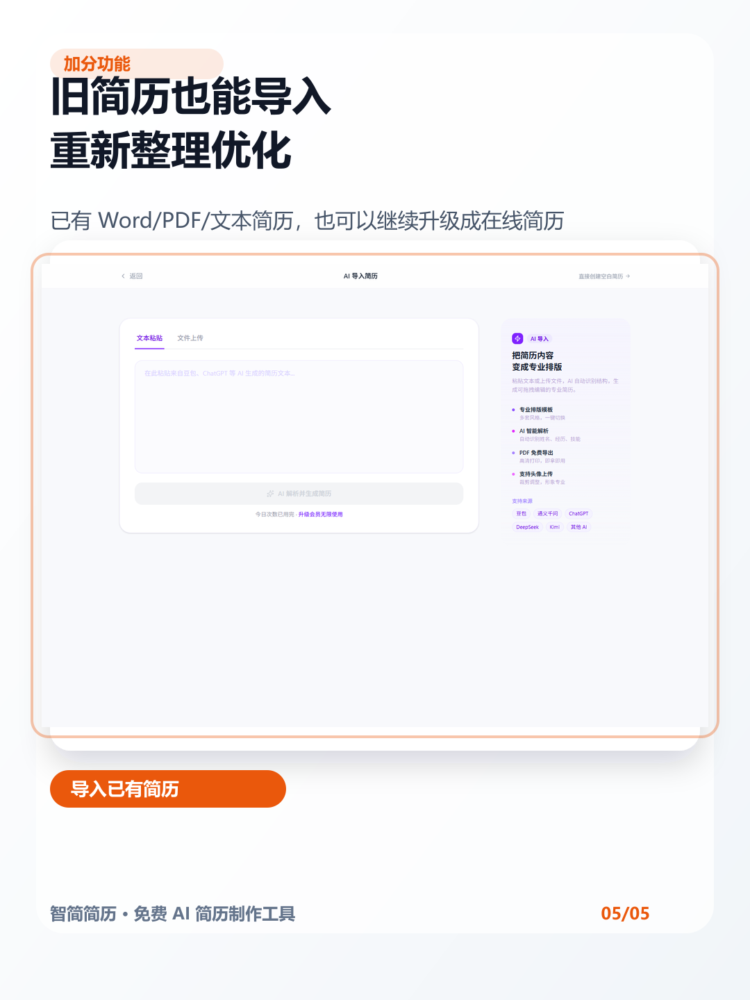

# 没经验不会写简历？这个 AI 工具真的省事

最近帮朋友改简历，发现很多人的问题不是经历不够，而是**不知道怎么把经历写得像简历**。

尤其是应届生、转行、实习经历少的人，经常卡在这几件事上：

- 不知道简历结构怎么排
- 不知道经历怎么写得专业
- 模板套来套去还是很乱
- 写完还担心导出有水印、格式不对

我试了下这个工具：**智简简历**。它比较适合想快速做出一份干净简历的人。

比较实用的点：

1. **AI 可以先帮你生成简历初稿**
不用一上来就面对空白文档，先把基本信息和目标岗位填进去，让 AI 帮你搭一版。

2. **可以边编辑边预览**
不是那种填表格填半天、最后才看到效果的工具，页面里能直接看到简历排版。

3. **模板按岗位分类**
前端、产品、运营、新媒体、设计这些岗位都有对应模板入口，不用自己纠结该选哪种结构。

4. **旧简历也能导入优化**
如果你已经有一份 Word/PDF 简历，也可以导入后再调整，不用从零重写。

适合人群：

- 应届生 / 在校生
- 实习经历不知道怎么写的人
- 想做一份干净简历但不会排版的人
- 已有旧简历，想重新整理优化的人
- 不想花钱买模板、也不想导出带水印的人

我的建议是：不要完全依赖 AI 直接生成最终版，最好把它当成“初稿助手”。先让它帮你生成结构和表达，再根据真实经历改细节，这样简历会更自然，也更像你自己。

#AI简历 #简历制作 #应届生简历 #秋招简历 #免费简历模板 #求职工具 #简历优化 #在线简历制作
